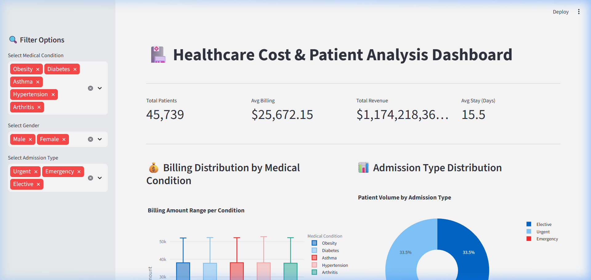

# 🏥 Healthcare Cost Analysis & Optimization System



[](https://www.python.org/)
[](https://streamlit.io/)
[](https://opensource.org/licenses/MIT)

## 📌 Project Overview
This project is a comprehensive data science solution designed to analyze healthcare costs, patient demographics, and hospital efficiency. It transforms raw medical data into actionable insights through deep exploratory analysis and an interactive executive dashboard.

## 🚀 Key Features
- **Interactive Dashboard**: A real-time Streamlit interface for dynamic data exploration.
- **Automated PDF Reporting**: One-click generation of professional executive summaries.
- **Advanced EDA**: In-depth analysis of cost drivers, admission types, and stay durations.
- **Data Quality Control**: Robust cleaning pipeline to handle outliers and ensure financial data integrity.

## 📊 Key Insights
- **Emergency Admissions**: Identified as the primary cost driver, significantly outpricing elective procedures.
- **Length of Stay Correlation**: Established a direct linear relationship between stay duration and billing complexity.
- **Operational Efficiency**: Ranked hospitals by revenue-to-patient volume ratio to identify top performers.

## 🛠️ Technology Stack
- **Data Processing**: `Pandas`, `NumPy`
- **Visualization**: `Seaborn`, `Matplotlib`, `Plotly`
- **Dashboard**: `Streamlit`
- **Reporting**: `fpdf2` (Automated PDF generation)

## 📂 Project Structure
```text
├── data/
│   ├── healthcare_dataset.csv         # Raw Data
│   └── clean_healthcare__dataset.csv  # Processed Data
├── reports/                           # Generated PDF Executive Reports
├── Healthcare Project.ipynb           # Deep Analysis Notebook
├── dashboard.py                       # Interactive Dashboard Code
├── reporting_system.py                # Automated Reporting Engine
└── README.md                          # Project Documentation
```

## ⚙️ Setup & Execution

1. **Clone the Repository**:
   ```bash
   git clone <repository-url>
   ```

2. **Install Dependencies**:
   ```bash
   pip install pandas matplotlib seaborn streamlit plotly fpdf2
   ```

3. **Launch the Dashboard**:
   ```bash
   streamlit run dashboard.py
   ```

4. **Generate a Report Separately**:
   ```bash
   python reporting_system.py
   ```

---
**Developed by [MOHAMED OUDA]**  
*Data Analyst |Al Automation Engineer *
